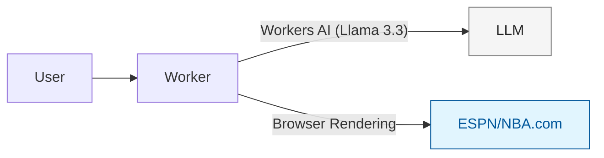

# 🏀 cf_ai_scout - AI Sports Analytics Agent

## Overview

cf_ai_scout is a real-time NBA analytics chatbot that browses live web data from ESPN and NBA.com using Cloudflare Browser Rendering.

## Live Demo

Deployed URL – coming soon after launch.

## Features

- ✅ Live NBA scores and stats from ESPN/NBA.com
- ✅ Real-time player performance queries
- ✅ Game results and box scores
- ✅ Stateless chat (fresh session every page load)
- ✅ Web browsing with Puppeteer

## Tech Stack

- Cloudflare Workers (stateless)
- Workers AI (Llama 3.3 70B)
- Browser Rendering (Puppeteer)
- Vercel AI SDK (tool execution)
- TypeScript + React

## Local Setup

```bash
git clone https://github.com/YOUR_USERNAME/cf_ai_scout
cd cf_ai_scout
npm install
npm start
```

Open http://localhost:5173 in your browser.

Note: Browser Rendering requires a remote binding during development.

## Usage Examples

- "Who won the Lakers game last night?"
- "Show me LeBron James stats from yesterday"
- "What's the current NBA scoreboard?"

## Architecture



## Requirements

- LLM: Llama 3.3 on Workers AI ✅
- Coordination: Browser Rendering tool ✅
- User Input: Chat interface ✅
- Real data: Live web scraping ✅
- State: Stateless (no persistence) ✅

## Future Enhancements

- Voice input via Realtime API
- Live game WebSocket feeds
- Multi-sport support (NFL, MLB)
