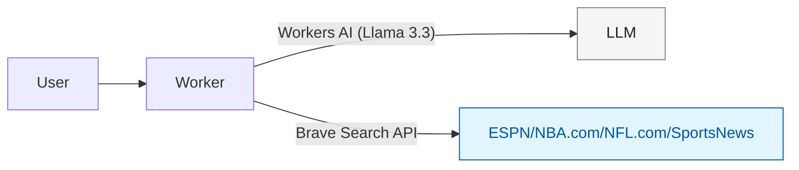

# 🏀 cf_ai_scout - Dual-Sport Analytics Agent (NBA + NFL)

## Overview

cf_ai_scout is a dual-sport analytics agent that fetches real-time NBA and NFL data from ESPN, NBA.com, NFL.com, and sports news sites using the Brave Search API.

## Live Demo

**Deployed URL:** https://my-chat-agent.nikhil-diddee23.workers.dev

The application is live and accessible. You can interact with the chat interface to ask questions about NBA and NFL data.

## Features

- ✅ Live NBA and NFL scores and stats from ESPN/NBA.com/NFL.com
- ✅ Intelligent sport detection and query optimization
- ✅ Real-time player performance queries
- ✅ Game results and box scores
- ✅ Stateless chat (fresh session every page load)
- ✅ Real-time data via Brave Search API
- ✅ Dual-sport support (NBA basketball and NFL football)

## Tech Stack

- Cloudflare Workers (stateless)
- Workers AI (Llama 3.3 70B)
- @cloudflare/ai-utils (native function calling)
- Brave Search API (Free tier)
- TypeScript + React

## Configuration

### Local Development
1. Get a Brave Search API key:
   - Visit https://api.search.brave.com/register
   - Choose the Free AI plan
2. Create a `.dev.vars` file in the project root:
   ```
   BRAVE_API_KEY=your_brave_api_key_here
   ```
   - Ensure `.dev.vars` is in `.gitignore` and never committed to version control.

### Production
- Set the BRAVE_API_KEY secret using Wrangler:
  ```
  wrangler secret put BRAVE_API_KEY
  ```
  - This securely stores the API key for production deployments.

## How It Works

The agent uses Cloudflare's native `@cloudflare/ai-utils` with Workers AI (Llama 3.3 70B) for intelligent tool calling:

- **Automatic Tool Execution**: Tools are invoked automatically when Llama determines that live data is required based on the query.
- **searchNBAData Tool**: Fetches real-time sports data from authoritative sources via the Brave Search API.
- **JSON Responses**: Returns structured JSON responses with answer text, links, and thinking metadata.
- **Stateless Design**: Each query is processed independently without retaining conversation history.

## Local Setup

```bash
git clone https://github.com/YOUR_USERNAME/cf_ai_scout
cd cf_ai_scout
cp .dev.vars.example .dev.vars
npm install
npm run dev
```

This starts the Cloudflare Worker locally. The Worker will be available at the URL provided by Wrangler (typically `http://localhost:8787`).

Alternatively, to run the frontend development server separately:

```bash
npm start
```

Open the provided URL in your browser.

Note: Configure your Brave API key in `.dev.vars` for local development. Ensure `.dev.vars` is in `.gitignore` and never committed.

## Deployment

1. Set the BRAVE_API_KEY secret for production:
   ```
   wrangler secret put BRAVE_API_KEY
   ```
2. Deploy the application:
   ```
   npm run deploy
   ```
3. Verify tool execution by checking logs:
   ```
   wrangler tail
   ```

## Usage Examples

- NBA: "Who won the Lakers game last night?", "Show me LeBron James stats"
- NFL: "Who's leading the NFL in passing yards?", "What's Patrick Mahomes' record?"
- Mixed: "Compare elite athletes in NBA and NFL"

## Testing

Test the agent's tool calling behavior with these example queries:

- **Greeting**: "hi" → Should respond with a warm greeting without calling any tools.
- **NBA Query**: "what were the nba scores yesterday" → Should call the `searchNBAData` tool to fetch live data.
- **NFL Query**: "who leads nfl in passing yards" → Should call the `searchNBAData` tool for current stats.
- **General Knowledge**: "how many quarters in basketball" → Should respond directly without tool usage.

## Architecture



## Requirements

- LLM: Llama 3.3 on Workers AI ✅
- Workflow/Coordination: Cloudflare Workers with searchNBAData tool using @cloudflare/ai-utils ✅
- User Input: Chat interface ✅
- Memory/State: Stateless (no persistence) ✅
- Real Data: Live web data fetching ✅
- Multi-sport: NBA and NFL support ✅

## Future Enhancements

- Voice input via Realtime API
- Live game WebSocket feeds
- Expansion to MLB and NHL support
